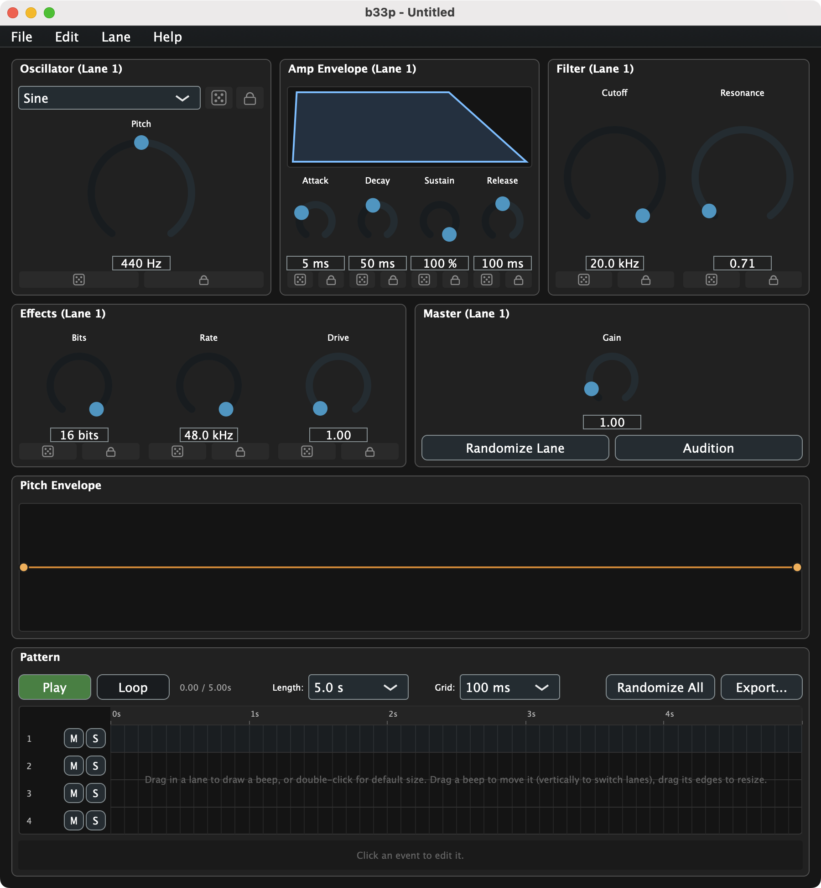

# b33p

> Small sounds. Fast iteration. Infinite dice rolls.

**b33p** is a focused sound-design tool for short synthesized beeps, blips, alarms, and droid chatter — the kind of sounds you'd hear from Star Wars droids, retro games, sci-fi UIs, and chirpy gadgets. Design a voice, lay it out on a pattern timeline, hit Randomize until something surprises you, then export a WAV.

Built for sound designers, game developers, and synth hobbyists who want a tight workflow for one specific problem: making a lot of good tiny sounds, quickly.

## Status

**v0.1.0 released — actively iterating toward v0.2.** Built binaries for macOS, Linux, and Windows are attached to each [GitHub Actions run on `main`](https://github.com/themightyzq/b33p/actions/workflows/build.yml). See [TODO.md](TODO.md) for the active backlog.

## Features

- **Per-lane voice design** — every lane in the pattern owns its own voice (4 lanes, 4 independently-tuneable timbres). Pick a lane in the pattern grid; the voice editor retargets to that lane's parameters.
- **Oscillator** — sine, square, triangle, saw, noise, plus a **drawable custom single-cycle waveform** per lane.
- **Drawn pitch envelope** — click in the curve to add points, drag to shape, right-click to delete. Shared across lanes.
- **ADSR amp envelope** — with a live visualiser.
- **Lowpass filter, bitcrush, distortion, master gain.**
- **Pattern sequencer** — 4 lanes, up to 10 seconds, per-event start / duration / pitch offset / velocity. Snap grid in milliseconds (10 ms ... 1000 ms, or off). Per-lane name, mute, and solo.
- **Direct-manipulation clip editing** — drag the body to move (vertically across lanes), drag either edge to resize, drag the top edge to set velocity, double-click empty grid to drop a clip at default size, or click + drag empty grid to draw any size. Cursor changes to telegraph the gesture.
- **Multi-select + clipboard** — shift-click to extend the selection, Cmd+A select all, Cmd+C / Cmd+V copy/paste at the playhead.
- **Generate random pattern** — right-click an empty lane area and pick "Generate random pattern in this lane" for instant rhythm.
- **Randomization with safety rails** — every parameter (except master gain) has a per-knob dice + lock; "Randomize Lane" rolls the selected lane's voice; "Randomize All" rolls every lane. Random rolls are capped at safe ranges so a single click can't blow ears or speakers (release ≤ 100 ms, attack ≤ 500 ms, resonance ≤ Q 5, drive ≤ 20).
- **Live editing during playback** — adding events, dragging clips, drawing custom waveforms — all audible within ~5 ms while the pattern loops.
- **WAV export** — 8 / 11.025 / 16 / 22.05 / 44.1 / 48 kHz; 8 / 16 / 24-bit; mono or stereo. Built for both clean renders and crunchy retro-console exports.
- **Project save / load** — `.beep` files carry the full project state, including custom waveform tables. Format is versioned with explicit migrations; older `.beep` files always open in newer b33p versions.
- **Full undo / redo** through every editing surface.

### On the v0.2 roadmap

- README quickstart + screenshot refresh, in-app audio settings menu, Edit menu with shortcut listings, in-app explanation of the per-lane voice model, output level meter. See `## v0.2 polish & doc sweep` in [TODO.md](TODO.md).

### Beyond v0.2

Roadmap highlights — see [TODO.md](TODO.md) for the full list:

- **Per-event probability, ratcheting, humanize**
- **Wavetable, FM, ring-mod oscillators**
- **LFOs and a modulation matrix**
- **Generator presets** — one-click starting points for droids, alarms, weapons, UI
- **Preset browser with tags**
- **VST3 / AU plugin builds**

## Screenshots



The full editor at default state: per-lane voice editor (Oscillator / Amp Envelope / Filter / Effects / Master) with a "(Lane N)" suffix telling you which lane you're editing, the shared drawable pitch envelope, and the pattern sequencer with per-lane name + mute + solo, snap grid, playhead readout, and Randomize-All / Export controls.

## Installation

Prebuilt binaries: grab the latest green CI run from [GitHub Actions](https://github.com/themightyzq/b33p/actions/workflows/build.yml) and download the `b33p-macos-latest`, `b33p-ubuntu-latest`, or `b33p-windows-latest` artifact. Or build from source:

### Prerequisites (all platforms)

- CMake 3.22+
- A C++17 compiler
- Git

### macOS

```sh
git clone https://github.com/themightyzq/b33p.git
cd b33p
cmake -B build -G Xcode
cmake --build build --config Release
```

The app lands at `build/B33p_artefacts/Release/b33p.app`.

### Windows

```powershell
git clone https://github.com/themightyzq/b33p.git
cd b33p
cmake -B build -G "Visual Studio 17 2022"
cmake --build build --config Release
```

The app lands at `build\B33p_artefacts\Release\b33p.exe`.

### Linux

```sh
sudo apt install libasound2-dev libjack-jackd2-dev libcurl4-openssl-dev \
  libfreetype6-dev libfontconfig1-dev libx11-dev libxcomposite-dev \
  libxcursor-dev libxext-dev libxinerama-dev libxrandr-dev libxrender-dev \
  libglu1-mesa-dev mesa-common-dev
git clone https://github.com/themightyzq/b33p.git
cd b33p
cmake -B build -DCMAKE_BUILD_TYPE=Release
cmake --build build
```

The app lands at `build/B33p_artefacts/Release/b33p`.

## Quick start — your first beep

1. Open b33p. The voice editor is on the left + middle; the pattern grid is at the bottom.
2. Click the **Audition** button (or press **Shift+Space**) to hear the default voice.
3. Click **Randomize Lane** in the Master strip a few times until something catches your ear. Click the lock next to any per-knob value to pin it across rolls.
4. In the **Pattern** grid at the bottom, drag in a lane to draw an event (or double-click for default size). Drag the body to move, drag the edges to resize, drag the top edge to set velocity, hit Delete to remove.
5. Press **Space** to start / stop pattern playback. Edits are audible immediately while looping.
6. Click **Export...** in the Pattern controls to render a WAV.

## Keyboard shortcuts

### Transport
| Shortcut | Action |
| --- | --- |
| `Space` | Play / stop the pattern |
| `Shift + Space` | Audition the selected lane's voice |

### File / Edit
| Shortcut | Action |
| --- | --- |
| `Cmd + N` | New project |
| `Cmd + O` | Open project |
| `Cmd + S` | Save |
| `Cmd + Shift + S` | Save As… |
| `Cmd + Z` | Undo |
| `Cmd + Shift + Z` | Redo |
| `Cmd + /` | About b33p |

### Pattern editing (when the pattern grid has focus)
| Shortcut | Action |
| --- | --- |
| `Cmd + A` | Select every event |
| `Cmd + C` | Copy the selected events |
| `Cmd + V` | Paste the clipboard at the playhead |
| `Delete` / `Backspace` | Delete the selected events |
| `←` / `→` | Nudge the selected events by one grid step |
| `Shift + ←` / `Shift + →` | Nudge by ten grid steps |
| `Esc` | Deselect everything |

On Windows / Linux, swap `Cmd` for `Ctrl`.

## Mouse / right-click

- **Drag in empty grid area** — draw a new event whose duration matches the dragged distance.
- **Double-click in empty grid area** — create an event at the default 100 ms duration.
- **Drag a clip body** — move horizontally; vertical drag retargets the lane.
- **Drag a clip's left or right edge** — resize.
- **Drag a clip's top edge** — set the event's velocity.
- **Click in the grid's ruler row (top strip)** — park the playhead at that time. Cmd+V then pastes the clipboard there.
- **Right-click on a clip** — Delete / Duplicate.
- **Right-click on empty lane area** — Generate random pattern / Clear lane.
- **Double-click on a lane label (the "1" / "2" / ...)** — rename the lane (persists in the `.beep` file).

## File format

Projects save as `.beep` files. A `.beep` is a versioned `ValueTree` serialization of the full project: per-lane voice parameters, pitch-envelope curve, pattern lanes / events / lane meta (name, mute, solo, custom waveform), and lock state. It's self-contained — no external sample files — so a `.beep` is portable and small.

The format is versioned (currently v2) with explicit migrations; older `.beep` files always open in newer b33p versions.

## Contributing

Issues are welcome — bug reports, feature requests, rough-edge sightings.

Pull requests: please open an issue first to discuss scope. The project has tight focus (see [TODO.md](TODO.md)), and PRs for items not on the active roadmap will be redirected rather than merged.

## License

Released under **GPL-3.0-or-later**. See `LICENSE` for the full text.

In short: you can use, modify, and redistribute b33p freely, but derivative works must also be GPL-3.0-or-later and distributed with source.

## Credits

- **b33p** by **ZQ SFX** — [github.com/themightyzq](https://github.com/themightyzq)
- Built with [JUCE](https://juce.com/)
- Tested with [Catch2](https://github.com/catchorg/Catch2)

---

For the full roadmap, see [TODO.md](TODO.md).
